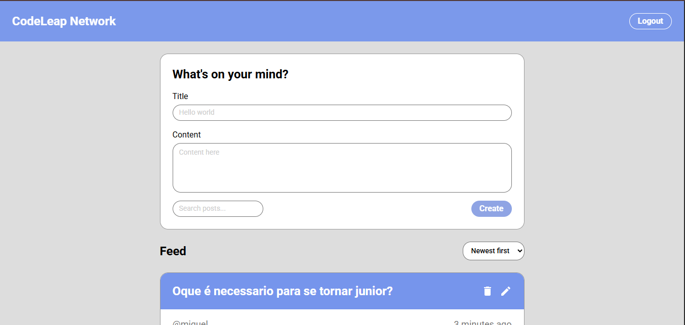

# CodeLeap Network

[](https://code-leap-test-tau.vercel.app)

<p align="center">
  
</p>

<p align="center">
  <a href="https://vitejs.dev/"></a>
  <a href="https://www.typescriptlang.org/"></a>
  <a href="https://react.dev/"></a>
  <a href="https://tailwindcss.com/"></a>
  <a href="https://redux-toolkit.js.org/"></a>
  <a href="https://reactrouter.com/"></a>
</p>

<p align="center">
  <a href="https://www.framer.com/motion/"></a>
  <a href="https://axios-http.com/"></a>
  <a href="https://headlessui.com/"></a>
  <a href="https://github.com/cure53/DOMPurify"></a>
  <a href="https://date-fns.org/"></a>
  <a href="https://react-hot-toast.com/"></a>
  <a href="https://vitest.dev/"></a>
</p>

<p align="center">
  <strong>Live Demo:</strong>
  <a href="https://code-leap-test-tau.vercel.app">code-leap-test-tau.vercel.app</a>
</p>

---

## About

**CodeLeap Network** is a social network for sharing posts, built for CodeLeap's technical assessment. It's a production-ready application with a strong focus on Product Experience (UX/UI), animations, responsiveness, and micro-interactions.

Key highlights:
- Full CRUD with optimistic UI and error rollback
- Infinite scroll pagination
- XSS protection with DOMPurify
- Fake comments and @mentions support
- Code splitting and lazy loading
- Fully responsive, mobile-first design

---

## Technologies

| Category | Technology | Purpose |
|----------|------------|---------|
| **Build** | Vite | Build tool and dev server |
| **Language** | TypeScript | Static typing |
| **UI** | React 19 | Components and hooks |
| **Routing** | React Router v7 | Client-side routing (`/login`, `/`) |
| **State** | Redux Toolkit | Global state (auth, posts, pagination) |
| **Styling** | Tailwind CSS v4 | Design system via `@theme` |
| **HTTP** | Axios | API client |
| **UI Components** | Headless UI | Accessible modals |
| **Animations** | Framer Motion | Transitions, stagger, hover effects |
| **Security** | DOMPurify | XSS protection, input sanitization |
| **Utilities** | date-fns | Date formatting (en-US) |
| **Feedback** | react-hot-toast | Styled notifications |
| **Testing** | Vitest + React Testing Library | Unit and component tests |

---

## Getting Started

### Prerequisites

- Node.js 18+
- npm or pnpm

### Installation

```bash
git clone https://github.com/your-username/codeleap-test.git
cd codeleap-test
npm install
```

### Environment Variables

Copy the example file and configure:

```bash
cp .env.example .env
```

| Variable | Description | Default |
|----------|-------------|---------|
| `VITE_API_URL` | CodeLeap API base URL | `https://dev.codeleap.co.uk/careers/` |

### Development

```bash
npm run dev
```

Open [http://localhost:5173](http://localhost:5173)

### Build

```bash
npm run build
```

### Preview Production Build

```bash
npm run preview
```

### Tests

```bash
npm run test
```

### Lint & Format

```bash
npm run lint
npm run format
```

---

## Features

### Core CRUD
| Feature | Description |
|---------|-------------|
| **Create** | New posts with title and content |
| **Read** | List with infinite scroll and pagination |
| **Update** | Edit posts via modal |
| **Delete** | Confirmation modal, optimistic UI with rollback on error |

### Sorting & Search
| Feature | Description |
|---------|-------------|
| **Sort** | Toggle "Newest first" / "Oldest first" (memoized selector) |
| **Search** | Local filter by title or content (SearchBar above feed) |

### Social Features
| Feature | Description |
|---------|-------------|
| **Comments** | Fake comments per post, persisted in `localStorage` |
| **@mentions** | `@username` detection in posts and comments with styled rendering |
| **Likes** | Heart button with count, persisted in `localStorage` |

### Security
| Feature | Description |
|---------|-------------|
| **XSS Protection** | DOMPurify sanitization for API content before render |
| **Input Sanitization** | Title and content sanitized in service layer before POST/PATCH |

### UX & Polish
| Feature | Description |
|---------|-------------|
| **Animations** | Staggered fade-in, modal transitions, hover/tap effects |
| **Scroll to Top** | Floating button after scrolling 500px |
| **Toasts** | CodeLeap blue (#7695ec) notifications for all CRUD actions |
| **Error Boundary** | Fallback UI on runtime errors |
| **Feedback States** | Empty and error SVGs with "Try Again" button |

### Responsiveness
- Mobile-first layout
- Sticky header with `backdrop-blur`
- Responsive modals and padding
- 8px spacing grid

---

## Project Structure

```
codeleap-test/
├── public/
│   ├── img.PNG           # README screenshot
│   ├── favicon.svg
│   └── _redirects        # Netlify SPA routing
├── src/
│   ├── components/       # Shared UI
│   │   ├── icons/        # Delete, Edit, Heart, Comment
│   │   ├── layout/       # Header
│   │   ├── ui/           # Button, Input, Modal, FeedbackState
│   │   ├── ErrorBoundary.tsx
│   │   ├── FormattedText.tsx   # @mentions
│   │   ├── SearchBar.tsx
│   │   └── ScrollToTop.tsx
│   ├── features/
│   │   ├── auth/         # Login, authSlice
│   │   └── posts/
│   │       ├── components/  # CreatePostCard, PostList, PostItem, CommentSection, modals
│   │       ├── hooks/      # usePostActions
│   │       ├── selectors/  # postSelectors (createSelector)
│   │       └── slice/      # postSlice
│   ├── services/        # API, postService
│   ├── store/           # Redux configureStore
│   ├── styles/          # globals.css, @theme
│   ├── types/
│   ├── utils/           # sanitize, errorHandler
│   └── constants/       # validation
├── vercel.json          # SPA rewrites
├── .env.example
└── package.json
```

---

## Production

### Deployed URLs

- **[code-leap-test-tau.vercel.app](https://code-leap-test-tau.vercel.app)** (main)
- [code-leap-test-git-main-alan-s-projects-0f71c943.vercel.app](https://code-leap-test-git-main-alan-s-projects-0f71c943.vercel.app)
- [code-leap-test-l0bicw78f-alan-s-projects-0f71c943.vercel.app](https://code-leap-test-l0bicw78f-alan-s-projects-0f71c943.vercel.app)

### Deployment

The project is configured for Vercel and Netlify:
- `vercel.json` for SPA routing
- `public/_redirects` for Netlify

---

## Design & Architecture

- **Design System** — Tailwind v4 tokens, palette and typography from [CodeLeap Figma](https://www.figma.com/design/6AizP09Fh9oEAWTLKsr1vQ/)
- **Architecture** — Feature-based structure, reusable components, SRP
- **Accessibility** — ARIA labels, Headless UI modals, semantic HTML
- **Code Quality** — TypeScript strict mode, ESLint, Prettier

---

## License

Developed for CodeLeap technical assessment.
